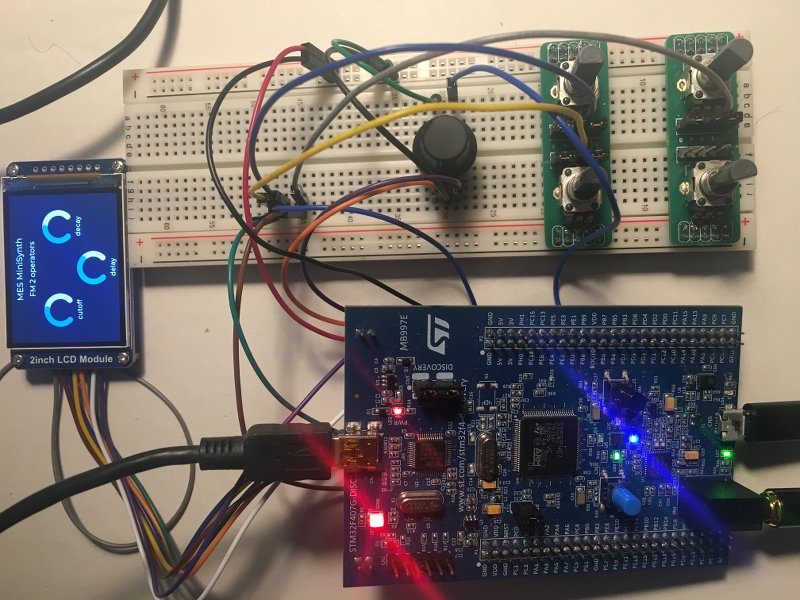

## MES MiniSynth

Small MIDI Synthesizer on STM32F407G_Discovery board.
- MIDI USB Host mode (for external USB midi keyboard or controller)
- Digital oscillators: bandlimited sawtooth, bandlimited pulse wave, 2 operators FM, sine
- 4-pole resonant lowpass filter (TPT _ zero delay feedback)
- 3 * Exponential ADSR envelopes
- Bitcrushing / rate decimator effect
- Stereo delay effect
- 2-inch LCD, LVGL graphics library

WIP...

### Thanks to:
Elecia White & everyone @ Making Embedded Systems  
Tom Erbe http://synthnotes.ucsd.edu/wp4/  
Xavier Halgand https://github.com/MrBlueXav/Dekrispator_v2/tree/dekrispatorV3  
Mutable Instruments https://pichenettes.github.io/mutable-instruments-documentation/  
https://github.com/Floyd-Fish/ST7789-STM32 
